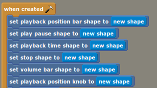
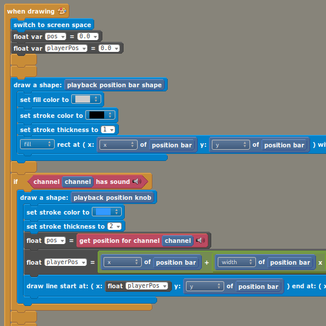
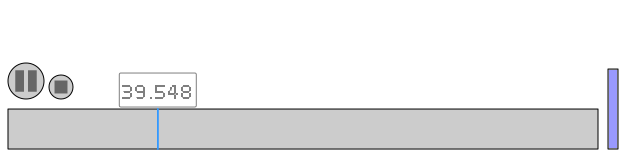

# Stencyl 4.1.5 — Development Release

This is a minor feature and bugfix release following up on Stencyl 4.1.0.

Please try it out by downloading from the below link, and let us know on Discord, on the forum, or on the issue tracker if you have feedback about the new features or if you run into any problems with this release.

## Download

[Multiplatform Release](https://www.stencyl.com/download/get/4.1.5/multiplatform/) (Windows, macOS, Linux)

## Changes since 4.1.4

**OS/Environment Support**
- Removed the dependency on Rosetta for arm64 macOS
- Added support for Wayland (Using XWayland for toolset, Wayland for engine)
- Java 21 -> 25
- Fix OS version detection for version strings with qualifiers (such as debian with `6.11.10+bpo-amd64`)

**Tools**
- Haxe 4.2.1 -> 4.3.7
- Neko 2.3.0 -> 2.4.1
- Hxcpp 4.2.1 -> 4.3.123
- Lime 8.0.1 -> 8.3.0
- Hxp 1.2.2 -> 1.3.1

**Launcher**
- [all] Fixed errors related to weak DH ciphers by updating the server (https://community.stencyl.com/index.php?issue=2249.0)
- [windows] Fix errors launching Stencyl if msys2/cygwin is installed (Always use absolute path to System32 binaries, including find, curl, and tar)
- [windows] Fix Windows launcher error when JDK is not yet installed (Enforce windows line endings to avoid errors when a label spans a block boundary)
- [linux] Don't immediately close terminal after an error occurs

**Logs**
- Don't print "failed to load behavior-events.lang" in logs
- Write log output with colors (red for errors, yellow for warnings) unless the `NO_COLOR` environment variable is present

**UI**
- [linux] Fix botched anti-aliasing of labels on SourceList components (e.g. dashboard sidebar)
- [linux] Fix flickering button graphics
- [linux] Fix flickering when changing tabs in Game Settings
- Add FlatLaf, allow styling properties to be loaded from a file
- Add a dark theme, this is a work in progress
- Don't shift focus when typing in game attribute category chooser
- Hide task progress display when prompts/notifications are shown

**Settings**
- Fix error when opening mobile settings page if android sdk is not set up

**Resources**
- Fix importing sounds on case-sensitive file systems
- Fix shallow copy of scene behaviors (modifying behaviors in a copied scene could affect the original scene)
- Fix error when downloading sounds from Stencylforge

**Git Support**
- Include a sublime-merge-like commit graph view
- Add diff viewer for design mode code and plain text files
> Structural changes (added/removed extensions, behaviors, attributes, blocks) aren't handled well yet
- Allow remote to be specified for git fetch/push/pull
- Add "Download Git Repo" option to welcome center context menu

**Design Mode**
- Allow literal and regex code searches to match block patterns (with property `STENCYL_SEARCH_ANALYZE_PATTERNS`)
- Analyze code for bad attr references (behaviors/attributes that don't exist)
> note: to allow using a behavior that does not exist, use `if < actor/scene has behavior >`
- Analyze code for needless use of attr references get/set blocks (setting an attribute in the current behavior)
- Fix error when event in behavior is not available in the event tree (https://community.stencyl.com/index.php?issue=2243.0)
- Fix error when pressing enter in event picker when event list is empty

**Code Mode**
- Update RSyntaxTextArea to enable code folding

**Codegen**
- Sort variables by display name in generated code output

**Building**
- [build tools] Show build errors popup if a compilation error occurs when building the lime or hxcpp tools.
- [native] Enhance the task display when building native games to show progress bars
- [native] Gather and show native compiler build errors instead of just logging them
- [native] Fix error building native games on non-Windows case-insensitive filesystems (this primarily affected macOS)
- [native] Fix building native games when haxelib paths have spaces (this primarily affected macOS)
- (on macOS) [all] Fix building when a system install of neko is present
- [mobile] When testing a game on a connected device, only build code for a single architecture
- [android] Use more recent version of android repository to download android platforms and tools
- [android] Fix being unable to accept android license (incorrect license hash due to a whitespace change in the license file)
- [ios] More stable cocoapods setup for extensions that need it
- [ios] Allow extensions to include frameworks that depend on Swift
- [windows] Easier install of Visual Studio build tools
- [compile server] By default, bind haxe compilation server to app lifecycle
> The first time in a Stencyl session that a game is built:
> 1. Any existing Haxe process on the computer is killed
> 2. A new compilation server is started
> When Stencyl is closed, if the compilation server is running, it will be killed
> 
> The compilation server can instead be manually managed by using the following config settings:
> `haxe.compile.server.managed=true`
> `haxe.compile.server.port=6000`

**Flash**
- Use Ruffle instead of Flash Player on platforms where Flash Player doesn't function properly (arm64 macOS, Linux)
- [linux] Fix debugging flash games in VS Code by ensuring that a binary called "flashplayer" is on the path

**Android**
- Min version 14 -> 21
- Max version 34 (Android 14) -> 36 (Android 16)
- Show error dialog if installing game to device fails
- Add NDKs 25-29, make 29 default
- Use 16KB page size for Android games (must build with NDK 28+)
- Increase default amount of memory available to gradle when building Android games
- Allow downloading Android platforms with a two-part API level (Android `16.0` started this)

**iOS**
- Fix launching games on iOS 17
- Load simulator device types stored outside of Xcode

**Hashlink**
- Hashlink updated from 12 to 16

**Game Logging**
- [android/ios] Add advanced game session logging configuration from file
- [android] Log native android crashes
> Symbolication requires symlink support. For Windows users, this needs to be enabled in Windows settings.
- [html5] Better parsing of logs for source locations and errors
- [android] Add "HXCPP" tag to default filter
- [all] Fix source code positions reported in stack traces that pass through EventDispatcher

**Publishing**
- [android] Export native symbols alongside android export artifact
- [ios] Ask about adhoc or not upfront, and fail quickly if everything isn't set up right

**VS Code**
- Fix Lime integration on macOS and Linux

**Engine**
- [html5] Fix recorded method type for js stack traces on v8
- [html5] Enable music streaming
- [all] Add TextureAtlas
- [all] Drawing and backgrounds can use tilemaps
- [all] Explicit shape drawing
  - Added "Draw Directly on Layers" setting to preserve behavior
- [native] Fix crash that may occur when shaders are used
- [all] Prevent subsequent "when created" events from running on a killed Actor
- [all] Make all behaviors initialize before "when created" events are run.
- [all] Make all scene transitions work better when screen size is changed in between scenes
- [all] Refresh background layers and tile layers when screen size is updated

**Extensions**
- [admob] Update SDKs (iOS to 11, Android to 24)
- [purchases] Always fire purchase restored events
- [purchases] Fix onStarted callback not being called
- [purchases] Update Google Play Billing to 8.0.0
- [google-play-games] Update play-services-games to v2
- [google-play-games] Added Saved Games (Snapshots API) and Force Login (Thanks @TF101!)
- [general] Allow specifying `html5` for extension platform compatibility

---

## Migration notes for users

This release adds the ability to partition a drawing into shapes. This allows the engine to track each drawn shape separately for better performance.

The previous mode was to combine all drawings on each layer into one large image.
If any drawing on a layer changed, the entire layer would need to be redrawn.
This was particularly problematic when a single layer had drawings in far-separated parts of the screen, causing a lot of wasted image memory.

The previous mode may still be used by settings the "Draw Directly on Layers" setting to true.

If that setting is disabled, and your game uses drawing blocks such as "draw line", "draw circle", "draw rect", "draw pixel", or "draw polygon", those blocks need to
be placed inside a "draw a shape" block in order to track which drawings belong to which shapes.

First, a "shape" attribute needs to be created

Then, for each shape, the "shape" attribute should be placed into the "draw a shape" block, and the line/circle/rect/pixel/polygon drawing blocks should be moved inside.

Generally, parts of a drawing that move and change together should be combined into a shape. In the music player example, the following are all different shapes:
- playback bar
- volume bar
- play/pause button
- stop button
- playback time
- playback control knob

Having distinct shapes for the playback bar and the control knob allow the playback bar to be drawn only once, and then knob is simply displayed on top of it and moved without redrawing anything.

